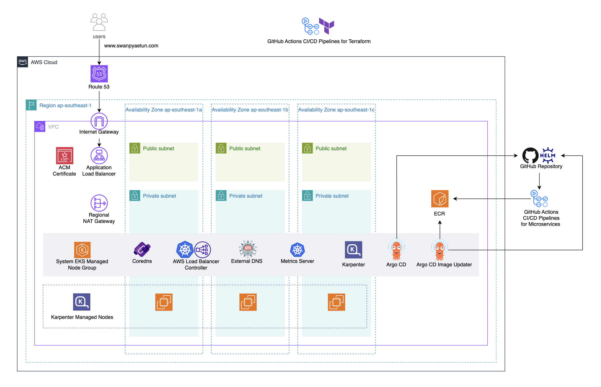

# swanpyaetun/swan_eks-infrastructure-for-retail-store-sample-app

# Automating EKS Infrastructure Provisioning with Terraform and GitHub Actions

- Tools used: GitHub Actions, Terraform, AWS, EKS, Helm, Argo CD, Argo CD Image Updater, AWS Load Balancer Controller, External DNS, Karpenter
- Provision EKS infrastructure with Terraform
- Set up GitHub Actions CI/CD pipelines to automate infrastructure provisioning
- Use GitHub Actions repository secret to store sensitive values
- Check Terraform format, check whether the configuration is valid, and generate Terraform plan file in swan_terraform_plan GitHub Actions job
- Create Terraform resources using Terraform plan file in swan_terraform_apply GitHub Actions job
- Use Terraform plan file, so that only reviewed resources during plan stage are applied, and no modification is done between plan and apply stage
- Use Route 53 public hosted zone, so that Route 53 domain can be accessible from the internet
- Create CI IAM role which only allows a specific GitHub repository in a specific GitHub organization authenticate to AWS using GitHub OIDC provider
- Secure GitHub Actions authentication to AWS by using short-lived OIDC tokens with automatic expiration, instead of storing long-lived IAM user credentials in GitHub
- Use S3 backend for Terraform remote state, and enable S3 state locking
- Enable Bucket Versioning in S3 for Terraform state recovery
- Group related AWS resources into individual Terraform modules, so that the same infrasturcture can be created easier and faster, and configurations can be standardized across environments and teams
- Use swan_ecr Terraform module to create private ECR repositories, and ECR lifecycle policy for each private ECR repository, which only keeps latest 30 container images
- Secure container images in private ECR repositories by enabling AES256 encryption type (Default encryption), and ECR basic scanning on every container image push to scan for OS vulnerabilities
- Use swan_acm Terraform module to create ACM certificate, and a record in Route 53 public hosted zone to validate the domain
- Use swan_s3 Terraform module to create S3 bucket
- Secure S3 bucket by blocking all public access, enabling Bucket Versioning, enabling SSE-S3 encryption type (Default encryption), and denying insecure http traffic with S3 bucket policy
- Use swan_vpc Terraform module to create VPC, public subnets, private subnets, internet gateway, regional NAT gateway, public route tables, and private route tables
- Allow both inbound and outbound internet access in public subnets with internet gateway
- Allow only outbound internet access in private subnets with NAT gateway
- Use regional NAT gateway to be highly available across AZs
- Use regional NAT gateway with auto mode, which automatically expands to new AZs and associates EIPs upon detection of an ENI, to reduce management overhead
- Use swan_eks module to create EKS cluster IAM role, EKS cluster, EKS node IAM role, system EKS node group, EKS addons, EKS access entries, Argo CD Image Updater IAM role, AWS Load Balancer Controller IAM role, External DNS IAM role, Karpenter interruption SQS queue, Karpenter interruption SQS queue policy, EventBridge rules, and Karpenter IAM role
- Deploy EKS control plane cross-account ENIs in private subnets
- Enable both public endpoint and private endpoint for EKS cluster
- Use "API" authentication mode, so that access entries can be used in EKS cluster
- Disable automatically giving cluster admin permissions to the EKS cluster creator
- Secure EKS cluster by enabling envelope encryption in EKS cluster (Default), enabling private endpoint for EKS api server, so that worker node traffic to EKS api server endpoint will stay within VPC, and creating EKS cluster admin as an IAM role that have short-term credentials, rather than an IAM user that have long-term credentials
- Deploy system EKS node group nodes in private subnets
- Use "ON_DEMAND" capacity type for system EKS node group nodes, so that system EKS node group nodes are reliable
- Enable node auto repair for system EKS node group
- Apply label and taint to the system EKS node group nodes, so that only system workloads can run on system EKS node group nodes
- Enable pod networking within EKS cluster with vpc-cni EKS addon
- Enable Prefix Delegation in vpc-cni to increase the number of IP addresses available to nodes and increase pod density per node
- Pre-allocate a prefix in vpc-cni for faster pod startup by maintaining a warm pool
- Enable network policy in vpc-cni to enforce Kubernetes network policies
- Enable service discovery within EKS cluster with coredns EKS addon
- Apply nodeSelector and toleration to coredns pods, so that they can run on system EKS node group nodes
- Enable service networking within EKS cluster with kube-proxy EKS addon
- Use eks-pod-identity-agent EKS addon, so that IAM roles can be associated with Kubernetes service accounts
- Enable automatic detection of node health issues with eks-node-monitoring-agent EKS addon, so that more node conditions for EKS node auto repair can be detected
- Secure Karpenter interruption SQS queue by encrypting data at rest by enabling SSE-SQS encryption type, encrypting data in transit (Default), and denying insecure http traffic with SQS queue policy
- Set up EventBridge to send "AWS Health Event", "EC2 Spot Instance Interruption Warning", "EC2 Instance Rebalance Recommendation", and "EC2 Instance State-change Notification" events to Karpenter interruption SQS queue, so that Karpenter can gracefully drain the affected node and provision a replacement
- Install Helm charts in EKS cluster with Terraform
- Use swan_helm Terraform module to install Argo CD, Argo CD Image Updater, AWS Load Balancer Controller, External DNS, Metrics Server, and Karpenter in EKS cluster
- Monitor ECR for new container image tags, and update the container image tags in the git repository with Argo CD Image Updater
- Create internet-facing ALB for Kubernetes ingress with AWS Load Balancer Controller
- Create DNS records in Route 53 public hosted zone with External DNS
- Apply nodeSelector and toleration to Argo CD pods, Argo CD Image Updater pods, AWS Load Balancer Controller pods, External DNS pods, Metrics Server pods, and Karpenter pods, so that they can run on system EKS node group nodes
- Use /16 network prefix for VPC, and /20 network prefix for private subnets to have a lot of ip addresses

## Table of Contents

- [1. Prerequisites](#1-see-prerequisites)
- [2. Technical Details](#2-see-technical-details)
- [3. Instructions](#3-instructions)
- [4. Additional Information](#4-additional-information)

## 1. See [Prerequisites](swan_docs/swan_docs//swan_prerequisites.md)

## 2. See [Technical Details](swan_docs/swan_docs/swan_technical_details.md)

## 3. Instructions

Run "Provision AWS Infrastructure with Terraform" pipeline to create EKS Infrastructure. 
"Provision AWS Infrastructure with Terraform" pipeline can be triggered in 1 way:
1. The CI/CD pipeline runs when a user manually triggers it.
 

Run "Terraform Destroy" pipeline to destroy EKS Infrastructure. 
"Terraform Destroy" pipeline can be triggered in 1 way:
1. The CI/CD pipeline runs when a user manually triggers it.

## 4. Additional Information

GitHub Actions CI/CD pipelines for microservices, and Kubernetes manifests: [https://github.com/swanpyaetun/swan_retail-store-sample-app](https://github.com/swanpyaetun/swan_retail-store-sample-app)